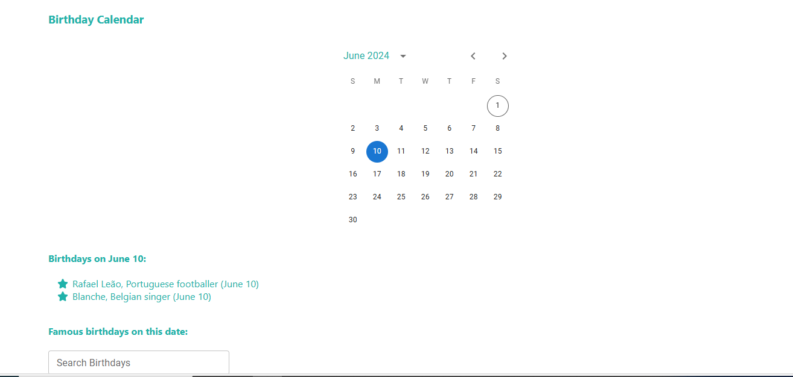

# birthday-calendar
A birthday calendar app implemented using Typescript and React.

Acceptance criteria:
-> When a day is clicked in the calendar, then a list of all birthdays for the selected day is displayed
-> There is a button next to a birthday to save someone’s birthday to a list of favourite birthdays
-> A list of favourite birthdays is displayed or accessible somewhere in the app

Implementation notes:
-> Build your app using React and TypeScript
-> Use the following calendar component for your app: https://mui.com/x/react-date-
pickers/date-picker/
-> Use the following API to get birthdays for a particular day:
https://api.wikimedia.org/wiki/API_reference/Feed/On_this_day
-> Unit tests for your component(s)
